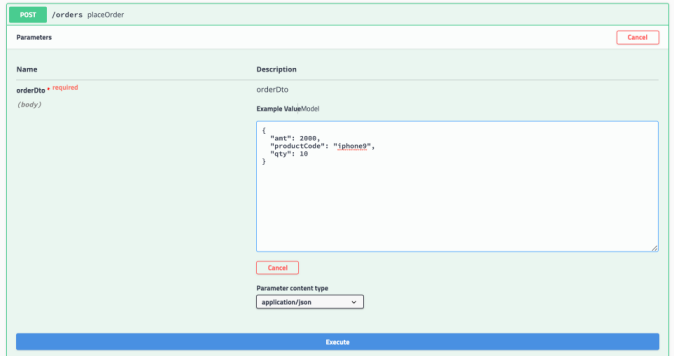
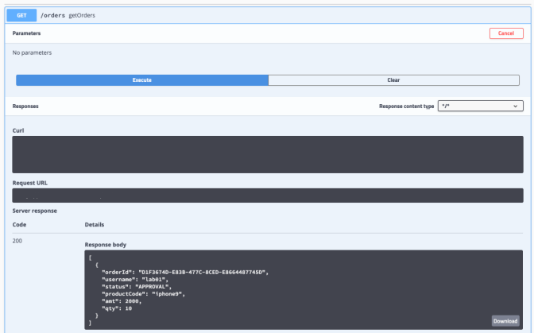

# order microservice
Order Microservice for Cloud Native Post Academy Deep Dive

개요
분산된 마이크로서비스에서 일관성을 유지하기 위해 잘 알려준 방법으로 크리스 리차드처럼
이벤트 기반으로 하는것과 REST Try-Confirm/Cancel 기반의 분산 트랜잭션을 처리하는 방법이 있다.

이 학습에서는 REST 기반 분산트랜잭션을 처리하여 일관성을 유지하는 방법으로 구현된 3 개의 마이크로서비스를
컨테이터화 작업하는 것을 학습합니다.


## 필수작업
 1. application.xml
    사용자별로 할당받은 ID를 appliation.xml 설정
```
# username : labNN
academy:
  username: lab01
```

 2. App 관련 작성 규칙 
   username을 기준으로 namespace로 만들고 자신의 앱을 배포하십시요
```
   2.1. namespace 작성 규칙 : 
      user + NN( 일련번호 2자리)
      ex)
      - user01
      - user02
          :
      - user40

   2.2. app name 작성 규칙 : 
      user + NN + "-" + post-fix (order|stock|payment  하나 선택)

      ex)
      - user01-order
      - user01-stock
      - user01-payment 

   2.3. YAML 파일 규칙 : 
      userNN + appname(order|stock|payment 하나 선택) + ".yaml
      userNN + appname-service + ".yaml"
      userNN + appname-config + ".yaml"

      ex)
      - user01-order.yaml
      - user01-order-service.yaml
      - user01-order-config.yaml
```

 3. iks 배포후 상품정보를 먼저 등록하고 주문수행




 4. 주문 성공 수행 결과를 조회



